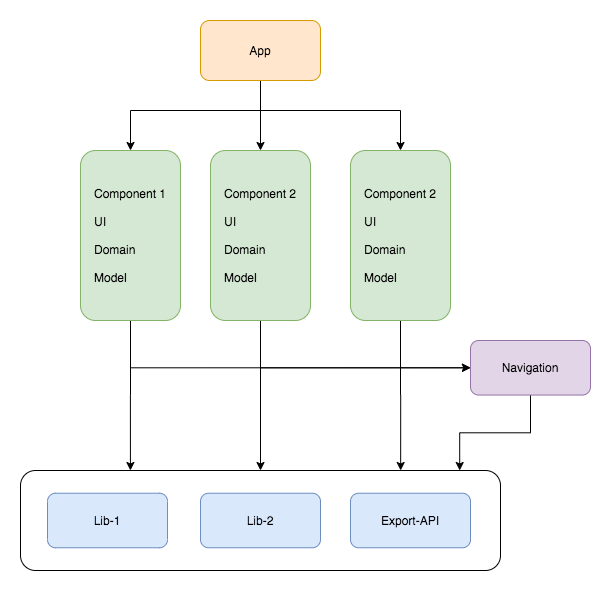
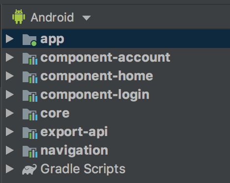
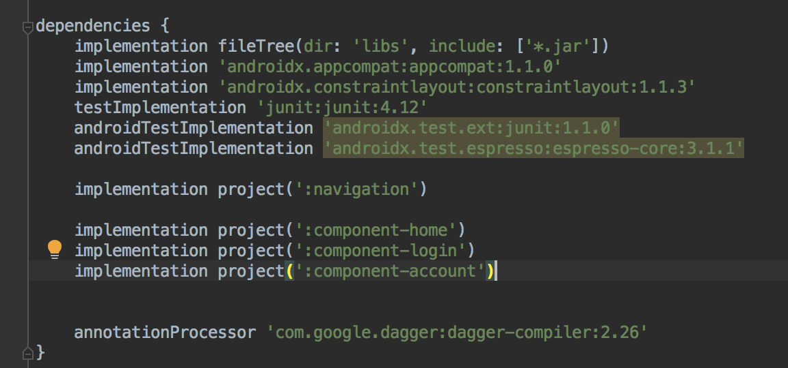

# 使用Dagger2对Android工程进行组件化

网上有很多组件化的框架，可以把组件之间的耦合解除了，但是项目却会和某一款组件化框架成了**强耦合**

如果不想依赖某一个组件化框架，有没有方法在目前的项目上进行组件化？

组件化的App基本架构如下图所示：



1. App是一个壳工程，依赖component1/component2/component3/...
2. 打包时，可以把某一个组件的依赖移除，不影响编译（gradle脚本里面注释掉implementation）。
3. 组件之间不之间依赖。

## 组件之间的通讯

无论哪种组件化方式，都需要一个中间者来连接每个组件。这个中间者就是`ComponentManger`。

`ComponentManger`在`Navigation`模块里面，然后每个组件依赖`Navigation`。

另外有一个`Export-API`的模块，每个组件需要暴露给其他组件的接口都定义在这里。

如果一个组件需要调用另外一个组件，大概是下面这个样子。

```
ComponentLogin loginComponent = ComponentManager.component(ComponentLogin.class);
if (loginComponent != null) {
    loginComponent.goToLogin(HomeActivity.this);
} else {
    Toast.makeText(HomeActivity.this, "No Component A", Toast.LENGTH_SHORT).show();
}
```

`ComponentHome`通过`ComponentManager`拿到`ComponentLogin`接口，然后跳转到登录界面。

因为`ComponentLogin`可能是没有的，所以调用组件接口的时候都需要判空。

这样`ComponentHome`组件可以不关心`ComponentLogin`的实现，也不会引用到`ComponentLogin`里面的一些内部类。

## 组件怎样注册到ComponentManager里面？
从依赖图来看，`Navigation`并不依赖组件，只依赖组件暴露的接口`Export-API`，好像也只能用反射来创建类了。

定义一个`ComponentResolver`接口，只有一个接口，返回一个`Component`
```
public interface ComponentResolver<T extends IComponent> {
    T getComponent();
}
```

这里用了Dagger2的Multibinding，把`ComponentResolver`对象放到一个map里面。key是`Component`的`className`，这里用`ComponentResolver`来返回对应的组件，是为了懒创建`Component`。

```
@Module
public class ComponentModule {

    Map<String, Object> componentObjectMap = new HashMap<>();

    @Provides
    @ComponentScope
    @IntoMap
    @ClassKey(ComponentLogin.class)
    public ComponentResolver provideLoginComponentResolver() {
        return new ComponentResolver<ComponentLogin>() {
            @Override
            public ComponentLogin getComponent() {
                return ComponentModule.this.getComponent("io.github.skyhacker2.component_a.component.ComponentLoginImpl");
            }
        };
    }

    // 新增一个组件增加一个Provider

    private <T> T getComponent(String className) {
        try {
            if (componentObjectMap.get(className) != null) {
                return (T) componentObjectMap.get(className);
            }
            Class clasz = Class.forName(className);
            T o = (T) clasz.newInstance();
            componentObjectMap.put(className, o);
            return o;
        } catch (Exception e) {
            e.printStackTrace();
        }

        return null;
    }
}
```

在App初始化`ComponentManager`，构建组件的依赖图。

```
@Component(modules = {ComponentModule.class})
@ComponentScope
public interface ComponentsComponent {
    Map<Class<?>, ComponentResolver> componentMap();
}
```

```
public class App extends Application {

    @Override
    public void onCreate() {
        super.onCreate();

        initComponentDependencies();

        initComponents();
    }

    private void initComponentDependencies() {
        ComponentManager.init(DaggerComponentsComponent.builder()
                .componentModule(new ComponentModule()).build()
                .componentMap());
    }

    private void initComponents() {

        ComponentAccount componentAccount = ComponentManager.component(ComponentAccount.class);
        if (componentAccount != null) {
            componentAccount.init(this);
        }

    }
}
```
`ComponentManager`的基本实现
```
public class ComponentManager {
    private static Map<Class<?>, ComponentResolver> sComponentMap;

    public static void init(Map<Class<?>, ComponentResolver> componentMap) {
        sComponentMap = componentMap;
    }

    public static <T> T component(Class<? extends IComponent> clasz) {
        try {
            return (T) sComponentMap.get(clasz).getComponent();
        } catch (Exception e) {
            e.printStackTrace();
        }

        return null;
    }
}
```

Demo的结构图：


1. App工程负责组装，初始化组件，跳转到HomeComponent。
2. HomeComponent首页，通过AccountComponent监听用户登录状态，可以跳转到LoginComponent。
3. LoginComponent是用户登录的界面，底层通过AccountComponent来实现登录逻辑。
4. AccountComponent是业务组件，没有界面，负责管理用户状态。

App的依赖：


1. 不需要某一个组件，就把对应的implementation注释掉。
2. 新增一个组件，需要改2个模块，`export-api`和`navigation`。
3. 组件暴露的接口要尽量少，把复杂的逻辑写在自身里面。


## 缺点也很明显
1. 组件无法编译时确定，用反射创建。
2. 单独运行某一个组件需要新建单独test工程。